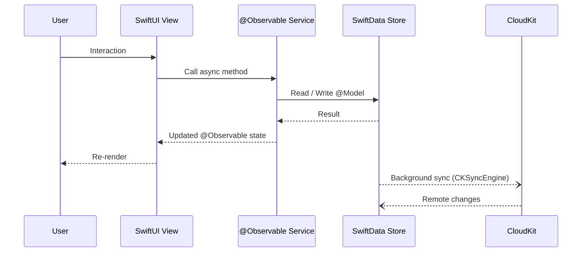
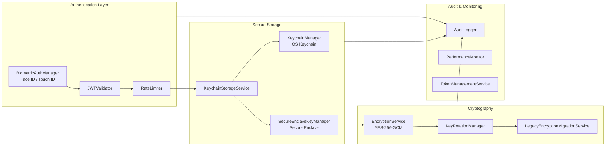
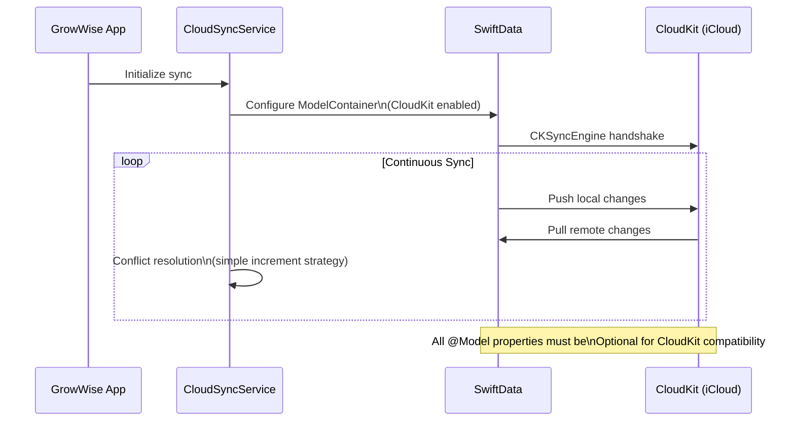
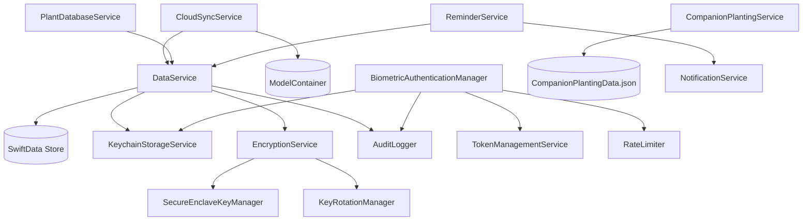

# GrowWise Application Architecture

## Package Structure

```mermaid
graph TD
    subgraph AppShell["GrowWise (App Shell)"]
        Entry[GrowWiseApp / MainAppView]
        Assets[Assets & Info.plist]
        CloudKit[CloudKit Schema]
    end

    subgraph Package["GrowWisePackage (Swift Package)"]
        subgraph Feature["GrowWiseFeature (SwiftUI Views)"]
            Views[Views/]
            Components[Components/]
        end

        subgraph Services["GrowWiseServices (Business Logic)"]
            DataSvc[DataService]
            AuthSvc[BiometricAuthenticationManager]
            SecuritySvc[KeychainManager / EncryptionService]
            CloudSvc[CloudSyncService]
            NotifSvc[NotificationService]
            PlantSvc[PlantDatabaseService]
            CompSvc[CompanionPlantingService]
        end

        subgraph Models["GrowWiseModels (Data Layer)"]
            SwiftData[@Model Classes]
            Enums[Enums & Value Types]
        end
    end

    Entry --> Feature
    Entry --> Services
    Feature -->|"@Environment(Service.self)"| Services
    Services --> Models
    AppShell --> Package
```

## Data Flow (MV Architecture)



## Security Architecture



## CloudKit Sync Flow



## Service Dependencies


