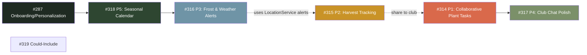

# Cultivation 1.1 Roadmap — Community coordination + outdoor wedge

**Created:** 2026-05-19
**Umbrella epic:** [#313](https://github.com/jbcrane13/GrowWise/issues/313)
**Status:** ready

## Theme

> Turn Club from "private feed/chat" into shared gardening coordination.

Cultivation 1.0 RC is on TestFlight. The 1.1 cycle merges two inputs:

1. **#287** — onboarding/personalization scope deferred from 1.0.
2. The 1.1 roadmap list — five prioritized community-and-outdoor themes
   plus a "could include" tier.

## Issue tree

```
#313 [1.1] Roadmap — Community coordination + outdoor wedge
├── #314 P1: Collaborative Plant Tasks
│   ├── #320  feature: SharedPlant model + CloudKit zone scoping
│   ├── #321  feature: Care activity feed entries on shared plant care
│   ├── #322  feature: Assigned-to / claimed-by state on shared reminders
│   └── #323  ui:      Shared-plants surface on Club tab
├── #315 P2: Harvest Tracking
│   ├── #324  models:  Harvest model with quantity, unit, plant, photo, notes
│   ├── #325  ui:      Log Harvest sheet from Plant Detail
│   ├── #326  ui:      Harvest history strip on Plant Detail
│   ├── #327  feature: Share harvest moment → Club feed
│   └── #328  feature: Seasonal harvest totals on Home and Profile
├── #316 P3: Frost & Weather Alerts
│   ├── #329  ui:      WeatherAlert card on Home (visible when alerts active)
│   ├── #330  feature: Local notification scheduling for frost / heat
│   ├── #331  feature: Heavy-rain reminder skip suggestion
│   └── #332  models:  Per-plant frost sensitivity flag
├── #317 P4: Club Chat Polish
│   ├── #333  models:  Read receipts (readByMemberIDs) on ClubMessage
│   ├── #334  feature: Send-state machine (sending → sent → failed → retry)
│   ├── #335  feature: Photo message improvements
│   └── #336  feature: Typing indicator (stretch)
├── #318 P5: Seasonal Planting Calendar
│   ├── #337  ui:      Annual calendar view (12-month timeline)
│   ├── #338  feature: First-frost-prep tasks generation
│   ├── #339  feature: Direct-sow window from seed inventory
│   └── #340  ui:      Seasonal task surface on Home
├── #287 Onboarding & Personalization fast-follow
│   ├── #341  feature: Goal-to-roadmap 7-14 day starter plan generator
│   ├── #342  feature: Zone + season-aware starter calendar in onboarding
│   ├── #343  feature: Shopping suggestions from garden + first plant
│   ├── #344  feature: Personalized tutorial rail
│   ├── #345  feature: Perenual prefetch + image cache + confidence + duplicate UI
│   ├── #346  feature: Onboarding branches per growing environment
│   ├── #347  feature: Onboarding activation analytics events
│   └── #348  feature: Advanced recommendation reasons
└── #319 Could-Include backlog
    ├── #349  feature: Light meter utility (camera lux estimate)
    ├── #350  feature: Public garden showcase polish
    ├── #351  feature: Club member profiles
    └── #352  feature: Follow / nearby feed v1.1 beta
```

## Dependency shape



**Recommended build order:** `#287 → #318 → #316 → #315 → #314 → #317`.
#314 is the highest roadmap priority but depends on shared-care
infrastructure that's most valuable once weather alerts (#316) and
harvest tracking (#315) give members something concrete to coordinate
around. #287 runs first because zone + personalization signals feed
#318 and #316.

## Existing reusable infrastructure (do NOT re-build)

| Capability | Lives at | Status |
|---|---|---|
| Frost / heat / heavy-rain alert detection (WeatherKit) | `GrowWisePackage/Sources/GrowWiseServices/LocationService.swift:307` | Computes alerts; **no UI surface, no push** |
| Zone-based frost dates + monthly activities | `GrowWiseServices/SeasonalPlannerService.swift` (`FrostDate.forZone`, `getMonthlyActivities`) | Used by `SeasonalTipCard`; not zone-aware in onboarding |
| Indoor-start-from-seeds | `SeasonalPlannerService.swift:170` | Already integrates `Seed.indoorStartWeeks` |
| Club activity feed + CloudKit publish | `GrowWiseModels/ClubActivity.swift`, `GrowWiseServices/ClubCloudKitService.swift` | `activityType` already documents `"watered"/"harvested"/"planted"` etc. |
| Journal harvest entry type | `GrowWiseModels/JournalEntry.swift:91` + `User.plantsHarvested` counter | No structured quantity/unit yet |
| Plant DB enrichment | `PerenualEnrichmentService.swift` | No background prefetch / image cache / confidence indicator |
| Starter plan engine | `StarterPlanService.swift` | 3-action lightweight plan; not multi-day |
| Shopping list | `ShoppingListService.swift` + `ShoppingItem` | Not driven by garden/plant creation |
| Tutorial service | `TutorialService.swift` | Not personalized |
| Club chat | `ClubChatView.swift`, `DataService+ClubChat.swift`, `ClubMessage` | No read receipts, no send state |

## 1.1 success criteria

- A club can actually coordinate shared garden care.
- Harvest creates a natural reason to share.
- Weather alerts make the app feel proactive.
- Outdoor gardeners see value Planta / Greg do not own.
